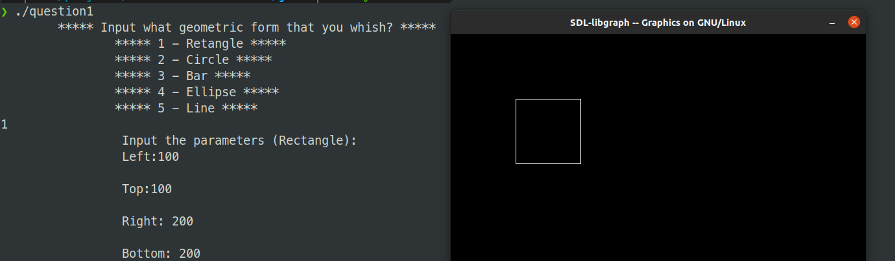
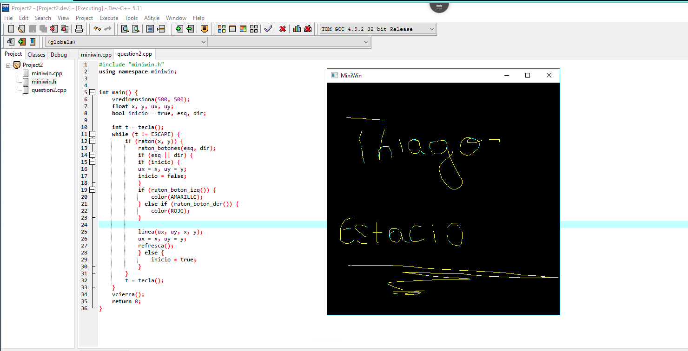

# Trabalho de Programação de Software Básico em C

## Nome: Thiago Vieira de Negreiros - 202203369067

### Questão 1 - Evidência de funcionamento

Obs: Esse fiz direto no linux ja que nao tenho uma maquina windows, depois que tinha feito vi que tinha como acessar o win remotamente e assim fiz a segunda questão.

### Questão 2 - Evidência de funcionamento

